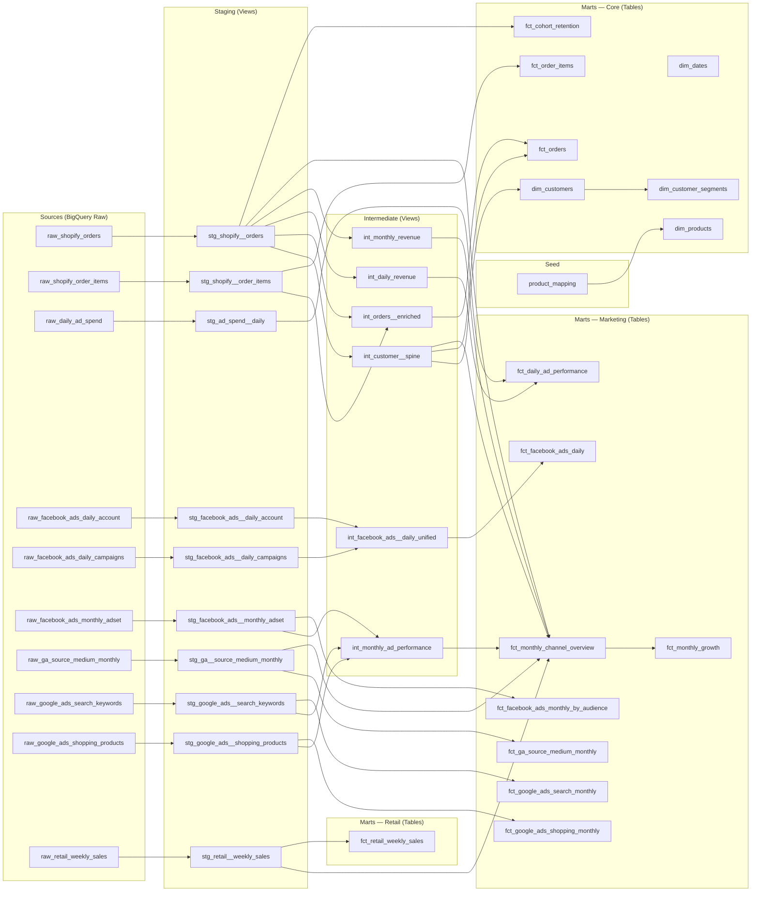

# Data Lineage — DTC Brand Analytics

```mermaid
flowchart LR
    subgraph sources["Sources (BigQuery Raw)"]
        raw_orders[raw_shopify_orders]
        raw_items[raw_shopify_order_items]
        raw_ad_spend[raw_daily_ad_spend]
        raw_fb_daily_acct[raw_facebook_ads_daily_account]
        raw_fb_daily_camp[raw_facebook_ads_daily_campaigns]
        raw_fb_monthly[raw_facebook_ads_monthly_adset]
        raw_ga[raw_ga_source_medium_monthly]
        raw_google_search[raw_google_ads_search_keywords]
        raw_google_shopping[raw_google_ads_shopping_products]
        raw_retail[raw_retail_weekly_sales]
    end

    subgraph seed["Seed"]
        product_mapping[product_mapping]
    end

    subgraph staging["Staging (Views)"]
        stg_orders[stg_shopify__orders]
        stg_items[stg_shopify__order_items]
        stg_ad_spend[stg_ad_spend__daily]
        stg_fb_daily_acct[stg_facebook_ads__daily_account]
        stg_fb_daily_camp[stg_facebook_ads__daily_campaigns]
        stg_fb_monthly[stg_facebook_ads__monthly_adset]
        stg_ga[stg_ga__source_medium_monthly]
        stg_google_search[stg_google_ads__search_keywords]
        stg_google_shopping[stg_google_ads__shopping_products]
        stg_retail[stg_retail__weekly_sales]
    end

    subgraph intermediate["Intermediate (Views)"]
        int_customer[int_customer__spine]
        int_orders[int_orders__enriched]
        int_daily_rev[int_daily_revenue]
        int_monthly_rev[int_monthly_revenue]
        int_fb_unified[int_facebook_ads__daily_unified]
        int_monthly_ads[int_monthly_ad_performance]
    end

    subgraph marts_core["Marts — Core (Tables)"]
        dim_dates[dim_dates]
        dim_customers[dim_customers]
        dim_products[dim_products]
        fct_orders[fct_orders]
        fct_items[fct_order_items]
        fct_cohort[fct_cohort_retention]
        dim_segments[dim_customer_segments]
    end

    subgraph marts_mktg["Marts — Marketing (Tables)"]
        fct_daily_ad[fct_daily_ad_performance]
        fct_fb_daily[fct_facebook_ads_daily]
        fct_fb_monthly[fct_facebook_ads_monthly_by_audience]
        fct_ga_monthly[fct_ga_source_medium_monthly]
        fct_google_search_m[fct_google_ads_search_monthly]
        fct_google_shopping_m[fct_google_ads_shopping_monthly]
        fct_channel[fct_monthly_channel_overview]
        fct_growth[fct_monthly_growth]
    end

    subgraph marts_retail["Marts — Retail (Tables)"]
        fct_retail[fct_retail_weekly_sales]
    end

    %% Sources → Staging
    raw_orders --> stg_orders
    raw_items --> stg_items
    raw_ad_spend --> stg_ad_spend
    raw_fb_daily_acct --> stg_fb_daily_acct
    raw_fb_daily_camp --> stg_fb_daily_camp
    raw_fb_monthly --> stg_fb_monthly
    raw_ga --> stg_ga
    raw_google_search --> stg_google_search
    raw_google_shopping --> stg_google_shopping
    raw_retail --> stg_retail

    %% Staging → Intermediate
    stg_orders --> int_customer
    stg_orders --> int_orders
    stg_items --> int_orders
    stg_orders --> int_daily_rev
    stg_orders --> int_monthly_rev
    stg_fb_daily_camp --> int_fb_unified
    stg_fb_daily_acct --> int_fb_unified
    stg_fb_monthly --> int_monthly_ads
    stg_google_search --> int_monthly_ads
    stg_google_shopping --> int_monthly_ads

    %% Intermediate → Marts Core
    int_customer --> dim_customers
    int_orders --> fct_orders
    int_customer --> fct_orders
    product_mapping --> dim_products

    %% Staging → Marts (direct)
    stg_items --> fct_items

    %% Intermediate → Marts Marketing
    int_daily_rev --> fct_daily_ad
    stg_ad_spend --> fct_daily_ad
    int_fb_unified --> fct_fb_daily
    stg_fb_monthly --> fct_fb_monthly
    stg_ga --> fct_ga_monthly
    stg_google_search --> fct_google_search_m
    stg_google_shopping --> fct_google_shopping_m

    %% Channel Overview (capstone)
    int_monthly_rev --> fct_channel
    int_monthly_ads --> fct_channel
    stg_ga --> fct_channel
    stg_retail --> fct_channel
    stg_orders --> fct_channel
    int_customer --> fct_channel

    %% Staging → Marts Retail
    stg_retail --> fct_retail

    %% Additional Core mart edges
    stg_orders --> fct_cohort
    dim_customers --> dim_segments

    %% Growth (from channel overview)
    fct_channel --> fct_growth
```
